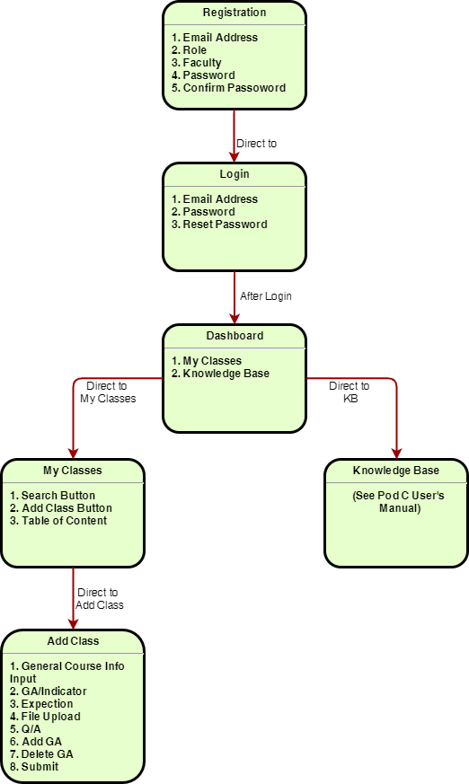

# oba-client
This client side contains frontend side **UI**, **integration code**, and **User Manual** for OBA client.  

The frontend architecture of this project is using simple [HTML + Bootstrap](https://getbootstrap.com/)(for UI styling) + [Ajax request](https://api.jquery.com/jquery.ajax/)(for Integration).

## Application User Instructions  
_Responsible: Jinkai Fan, Jiahao Li_
> This User Instruction Documentation provides a general walkthrough of the [OBA web application](https://maciag.ursse.org/oba/login.html) from the initiation.  

### Registration
A user email address (**`@uregina.ca only`**), a role a faculty, and a password (**`at least 6 characters long, 1 uppercase, 1 lowercase`**) is required to create a new accout for this web applicaiton.  
***

### Logging On
A `@uregina.ca email` and `password` are required to log onto the web interface.  

### Forgotten and Reset User Password
Not applicable at the moment.  
***

### Dashborad Page
This is the `home page` for this application.  

Users  can click any one of these categories `My Classes` and `Knowledge Base`  Box for the users to select upon their needs.  

Users can redirect to this page from any location by clicking the  top blue title `Engineering Courese Management`.  

`+` is the menu button and user profile section are not applicable at the moment.  
***

### My Classes Page
This page shows general information about every added classes.  

A `search button` (not applicable so far) provides a option for users to filter the class, a `drop-down` form is applied to this button, users can specify any class by inputting the keyword in each `input field`.    

Users can add any class by entering the `Add Class Page`.    

All added classes will be shown on the table separated by each row below the page.  

Users can click any classes to the `Add Class Page`  to modify any information.  
***

### Adding Class Page
This page allows users to input and save any applicable attributes of one class, and show these added classes on `My Class Page` .  

A `faculty name`, `course number`, `term`, `year`, `GA`, `indicators`, `Q/A` and are required for adding the class.  

Users are allowed to upload supporting `documents` on this page.

Users can delete any `GA` anytime by clicking the `red Delete GA` button on the top.

Users can have multiple GAs at the time by clicking the `Add GA` button on the bottom.

Users can submit the form anytime by clicking the `Submit` button on the bottom.

Users can redirect to `My Classes Page` by clicking the `Back to My Classes` button on the bottom.
***

### Application Workflow

